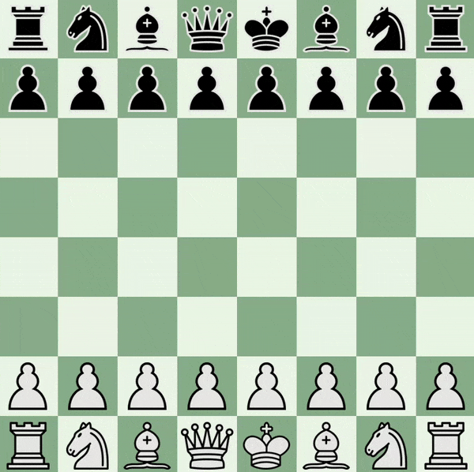

# Game



# NOTES

1. **Use refrences as you can.**
2. **If you call a faunction that take a cont arg like this**

```cpp
bool Board::IsEmptySquare(const Point &point)
{
    if (pieces[point.GetX()][point.GetY()] == nullptr)
        return true;
    else
        return false;
}
```

The methods ```GetX()``` and ```GetY()``` must also be const because the compiler cannot guarantee that calling ```point.GetX()``` will not change your constant reference to ```point```, thus it raises an error.

3. virtual keyword is used to declare a virtual function, indicating that the function can be overridden by derived classes. In C++, = 0 after a virtual function declaration is known as a pure virtual function declaration. It indicates that the function is a pure virtual function and that **any class containing at least one pure virtual function is an abstract class**. An abstract class is a class that cannot be instantiated on its own; it must be subclassed, and the pure virtual functions **must** be implemented by the subclasses or it will also be considered an abstract class. const keyword at the end of the function declaration indicates that the function is a const member function. It means that the function does not modify the object on which it is called.

4. **I learned more abour virtual function.**

* If there is no polymerphism, any function in the base class cannot be overrided in the subclass.
* If there is polymerphism and there is a virual function in the base class that is overrided in the sub class, then the called function will be the one in the sub class.
* If there is polymerphism and there is a non-virual function in the base class that is overrided in the sub class, then the called function will be the one in the base class.
* If there is polymerphism and there is a virual function in the base class that is not-overrided(does not exist) in the sub class, then the called function will be the one in the base class.
* If there is polymerphism and there is a virual function in the base class that is implemented with different signature in the sub class, then the called function will be the one in the base class.

5. **I learnled more about std::vector**

* You can reserve initial size for the vector using ```reserve()``` to reduce recopying.
* ```clear()``` set size to zero and also delete all the data.
