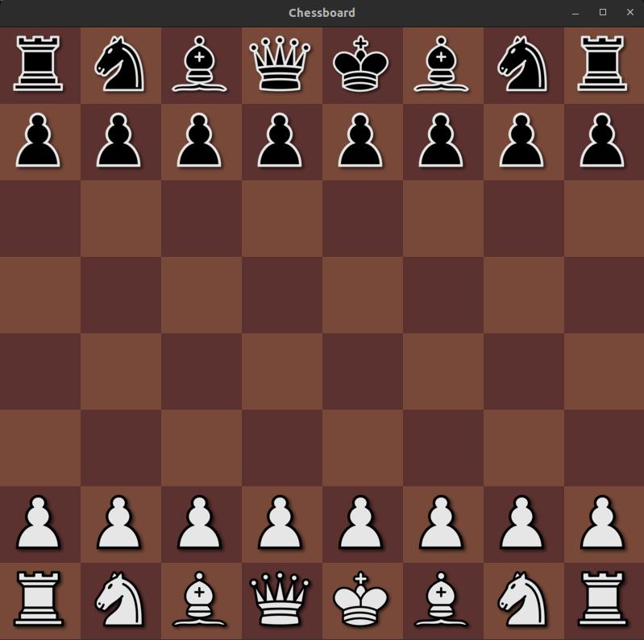

# Game



# NOTES

1. Use refrences as can as possible.
2. If you call a faunction that take a cont arg like this

```cpp
bool Board::IsEmptySquare(const Point &point)
{
    if (pieces[point.GetX()][point.GetY()] == nullptr)
        return true;
    else
        return false;
}
```

The methods ```GetX()``` and ```GetY()``` must also be const because the compiler cannot guarantee that calling ```point.GetX()``` will not change your constant reference to ```point```, thus it raises an error.
